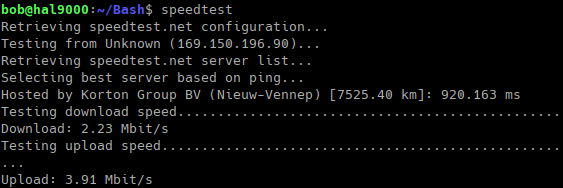
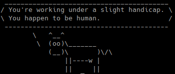
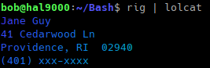
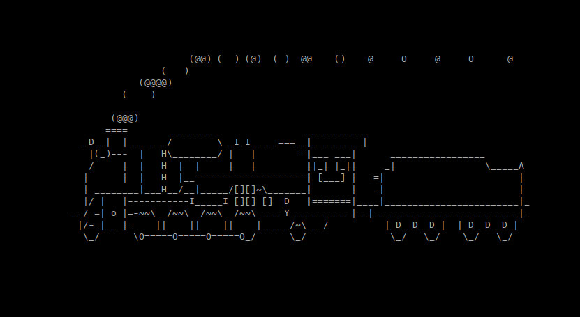

# Bash
*Bash tools and stuff*
&nbsp;    

<hr>

### **Prereq**
**Install [Linux Debain 12](https://cdimage.debian.org/debian-cd/current-live/amd64/iso-hybrid/)**
```sh
$ sudo apt -y isntall screenfetch
$ screenfetch
```
*screenfetch output*
  
<hr>

### **Grep for multiple phrases**
```sh
$ ls | grep 'phrase1\|phrase2' 
```
<hr>

### **Bash encryption tool**
```sh
$ sudo apt -y install mcrypt
$ nano test_file.txt #create test file
```
*GNU nano &nbsp;test_mcrypt.txt*
```bash
encrypt this file with mcrypt

testing...

42
 42
  42
   42
  42
 42
42
```
```bash
$ nano key.txt #create key
```
*GNU nano &nbsp;key.txt*
```sh
greatPassword42!
```
```sh
$ mcrypt test_mcrypt.txt --keyfile key.txt # encrypt file 
$ rm test_mcrypt.txt # remove original
$ ls
key.txt  README.md  test_mcrypt.txt.nc
$ mcrypt --decrypt text_mcrypt.txt.nc --keyfile key.txt
$ ls
key.txt  README.md  test_mcrypt.txt.nc  test_mcrypt.txt  
```
&nbsp;
*Require a password/key to view decrypted file*
```sh
$ mcrypt encrypted_file.txt; rm encrypted_file.txt # only the encrypted file remains
Enter passphrase:
$ mcrypt -d encrypted_file.txt.nc
Enter passphrase: 
File encrypted_file.txt was encrypted.
```
*Now you can encrypt all of your files so no one view them without the key/passphrase* 
&nbsp;  
### **Look pro**
```sh
$ sudo apt -y install hollywood
$ hollywood
```
*Hollywood Screenshot*

&nbsp;   
### **Internet speed test CLI**
*After cloning this bash repo...*
```sh
$ sudo apt -y install speedtest-cli
$ speedtest
```

&nbsp;   
### **Running Bash via Python**
*prereq*
```sh
$ sudo apt -y install cmatrix
```
*bash.py*
```py
import os

bash_command = os.popen('konsole --fullscreen -e cmatrix')
output = bash_command.read()
print(output)
```
```sh
$ python bash.py
```
*bash.py outputs cmatrix*

&nbsp;   
### **Send command via SSH to Raspberry Pi**
```sh
$ ssh pi@localhost 'ls -l'
```
&nbsp;   
### **Running dog**
*Have a dog running accross your screen*
```sh
$ sudo apt -y install oneko
$ oneko -dog -fg cyan
```
  
### **Cow delivered fortune**
```sh
$ sudo apt -y install fortune 
$ sudo apt -y install cowsay
$ fortune | cowsay
```
  

### **Generate  random addresses**
```sh
$ sudo apy -y install rig
$ rig
```

&nbsp;   
### **Wikipedia Data**
_Could be useful for gathering semi-random data for data science/machine learning programs_  
&nbsp;  
*Prereq*
```sh
$ sudo apt -y install nodejs
```
*Wiki package install*
```sh
$ sudo apt -y install wikit -g
```
*Run a wiki query*
```sh
$ wikit "machine learning"
```
*wikit machine learning output*  

&nbsp;  

### **Battery Status**
```sh
$ sudo apt -y install acpi
$ acpi -b
Battery 0: Discharging, 16%, 00:27:07 remaining
```
&nbsp;  
### **Fuzzy Finder Search**
```sh
$ sudo apt -y install fzf
$ fzf
```

&nbsp;  
*Searching for mcrypt encrypted files within this bash repo*
&nbsp;  
### **Terminal Search**
```sh
$ conda install googler
```
&nbsp;
### **Terminal Train**
```sh
$ sudo apt -y install sl 
```
